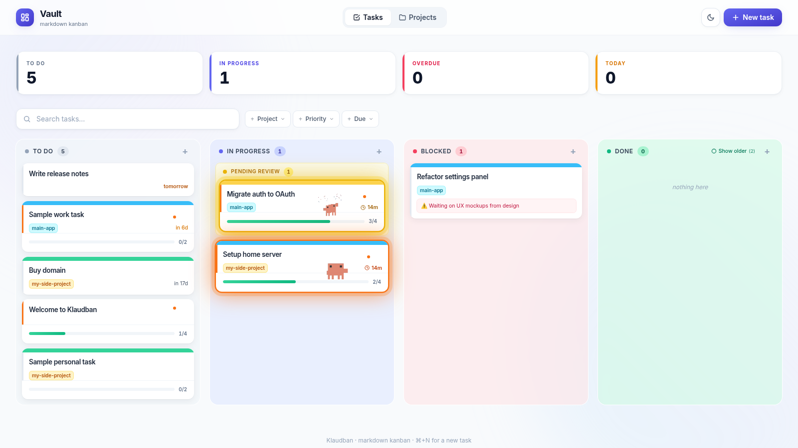
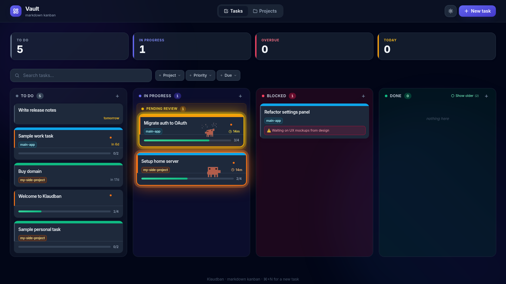
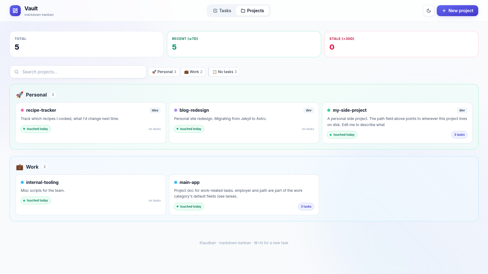
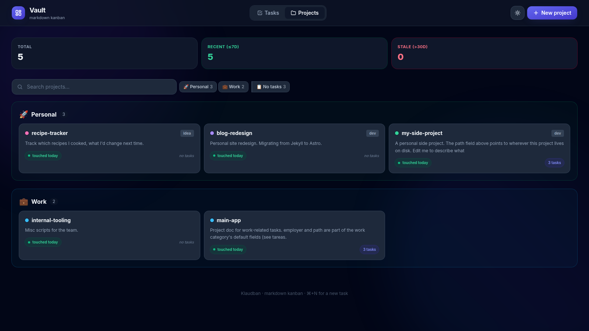
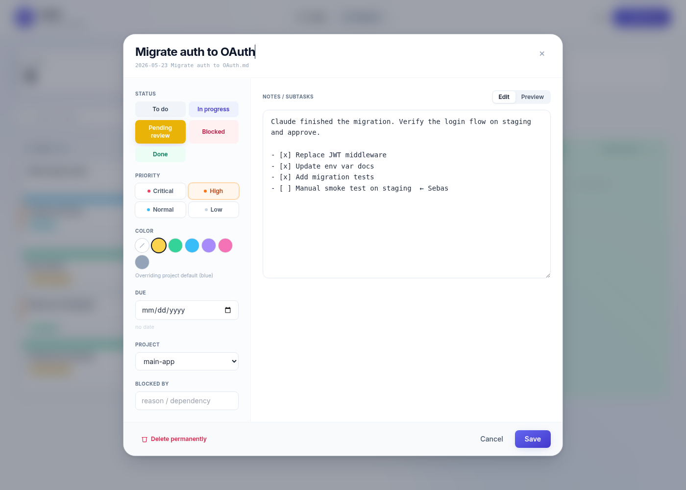
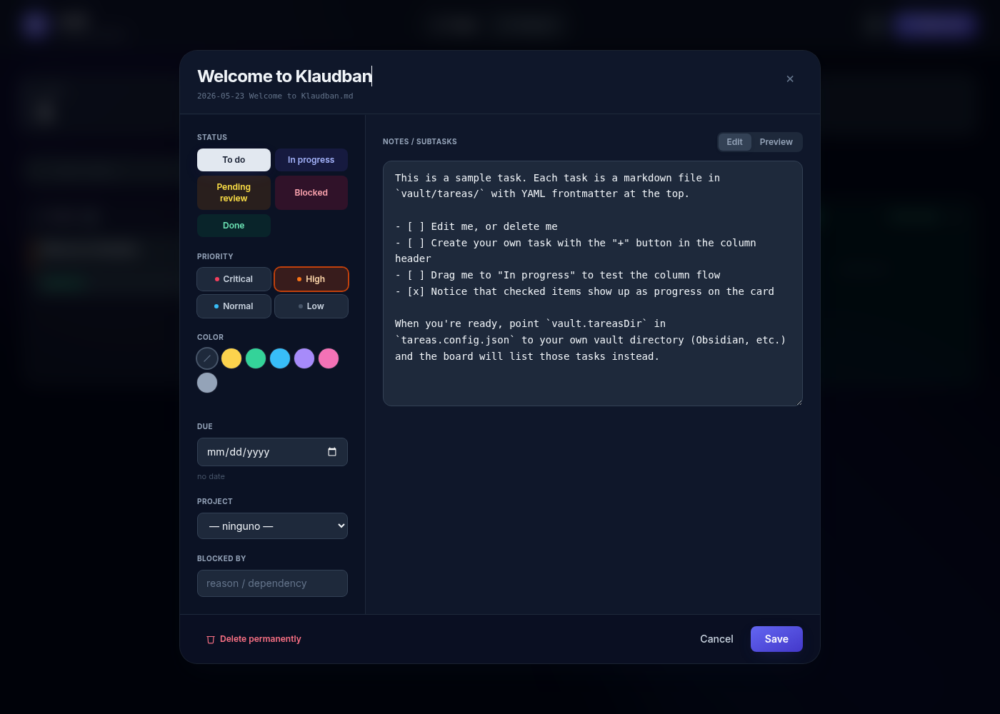

# Klaudban

A self-hosted **markdown kanban built for AI agents**. Every task is a `.md` file in your vault. No database, no accounts, no SaaS. Claude-ready out of the box, works fine standalone.

<table>
  <tr>
    <td width="50%"></td>
    <td width="50%"></td>
  </tr>
  <tr>
    <td></td>
    <td></td>
  </tr>
  <tr>
    <td></td>
    <td></td>
  </tr>
</table>

Each card can copy a prompt with three `curl`s that an agent runs to mark the task as in-progress, finished, or pending-review. The board reflects the agent's progress in real time. Or just use it as a plain markdown kanban with the Claude integration turned off.

## Obsidian-compatible

Drop-in over an existing Obsidian vault: the tasks and project files are regular markdown with YAML frontmatter, the wiki-link embeds (`![[image.png]]`, `[[note]]`) render natively in both Obsidian and this board, and the directory layout (`tareas/`, `projects/`, `embeds/`) is plain folders that Obsidian indexes without any plugin. Edit a task in Obsidian on your phone, edit it in this board on your laptop, both see the same file. Pair it with Syncthing / iCloud / Git for sync.

## Features

- **Markdown-first.** Each task is `vault/tasks/YYYY-MM-DD Title.md` with YAML frontmatter (`status`, `priority`, `due`, `project`, etc.). Edit them in any editor or by hand. Sync via Syncthing / Dropbox / iCloud — anything that propagates files works.
- **Four columns + a yellow sub-section.** *To do*, *In progress*, *Blocked*, *Done*. A "Pending review" strip above *In progress* shows what the agent finished but still needs human action.
- **Projects view.** A second tab groups projects by configurable category (default: *Personal* and *Work*) with freshness badges (based on `mtime`, so it shows real activity regardless of whether you use Claude or not).
- **Optional Claude integration.** When enabled, each card has a "copy prompt" button. The agent runs `op=start/done/review` `curl`s and the board updates within 5 seconds. When disabled, the bell and the copy buttons are hidden — it works as a plain markdown Kanban.
- **No env vars.** A single optional `klaudban.config.json` controls vault paths, timezone, header title, project categories, and the Claude integration.

## Quick start

### With Docker (recommended — one command)

```bash
git clone https://github.com/YOUR_USER/klaudban.git
cd klaudban
docker compose up -d
```

Open <http://localhost:4321/>. Tasks go in `./vault/tasks/` (mounted into the container). Edit `klaudban.config.json` to point at your real Obsidian vault and re-up.

### With Node.js installed

```bash
git clone https://github.com/YOUR_USER/klaudban.git
cd klaudban
npm install
npm run dev
```

Open `http://localhost:4321/`. The app reads tasks from `./vault/tasks/` by default. Edit the sample task or add new ones.

To build for production:

```bash
npm run build
HOST=127.0.0.1 PORT=3004 npm start
```

(`HOST` and `PORT` are read by Astro's Node adapter at runtime — they're not application configuration.)

### If you have never run a Node app

1. Install Node.js 20+ from <https://nodejs.org/> (the LTS download is fine).
2. Open a terminal in the folder where you want the project to live.
3. Run the four commands in the box above. `npm install` will pull dependencies for a couple of minutes the first time; the rest is instant.
4. Open `http://localhost:4321/` in your browser. You should see the board with the sample tasks.
5. Stop the server with `Ctrl+C` in the terminal.

If anything fails, the most common reason is the wrong Node version. Run `node --version` — it must say `v20.18.0` or higher.

## Configuration

All app configuration lives in `klaudban.config.json` at the project root. The file is **optional**; if absent, defaults apply. Copy `klaudban.config.example.json` to start:

```bash
cp klaudban.config.example.json klaudban.config.json
```

```jsonc
{
  "vault": {
    "tasksDir":   "./vault/tasks",     // where tasks live (.md files)
    "projectsDir": "./vault/projects",   // where project docs live
    "embedsDir":   "./vault/embeds"      // images/audio/video referenced from tasks
  },
  "ui": {
    "timezone": "UTC",                   // IANA tz for "today" / "due today" filters
    "title":    "Vault"                  // text in the header
  },
  "claude": {
    "enabled":    false,                 // true to show the "copy prompt" buttons and the bell
    "apiBaseUrl": "http://localhost:3004" // base URL the agent will curl against
  },
  "projects": {
    "categories": [
      { "key": "personal", "label": "Personal", "emoji": "🚀", "fields": ["type", "updated", "status", "path"] },
      { "key": "work",     "label": "Work",     "emoji": "💼", "fields": ["type", "updated", "employer", "path"] }
    ]
  }
}
```

Pointing the app at your Obsidian vault is just:

```jsonc
{ "vault": { "tasksDir": "/Users/you/Documents/MyVault/tasks", "projectsDir": "/Users/you/Documents/MyVault/projects", "embedsDir": "/Users/you/Documents/MyVault/attachments" } }
```

### Project categories

The `projects.categories` array defines what folders the Projects view groups things into. Each category gets:

- `key` — folder name under `projectsDir/` (also used as the value of the `type:` frontmatter prefix, e.g. `project-personal`).
- `label` — display name in the UI.
- `emoji` — small icon in the category header.
- `fields` — the structured frontmatter inputs shown in the project edit modal. For example, `["type", "updated", "status", "path"]` means the edit modal shows inputs for those four fields. The `path` field is a plain text input — you fill it with wherever the project lives on disk (e.g., `/Users/you/code/my-side-project`). It's not validated; it's just a reminder/link.

You can add more categories: `freelance`, `learning`, `housing`, whatever. The folders under `projectsDir/` are created on demand when you save the first project in a new category.

## Task file format

```markdown
---
date: 2026-05-23
type: tarea
status: pending          # pending | doing | blocked | pending-review
priority: normal         # critical | high | normal | low
due: 2026-05-30          # optional
project: my-project      # optional, matches a file in projects/<category>/
pos: 100                 # optional, manual ordering (higher = top)
claude_active: true      # optional, set by op=start, shows the active animation
color: yellow            # optional banner color (yellow|green|blue|purple|pink|gray)
---

Task body in markdown. Supports subtasks:

- [ ] First step
- [x] Done step

Obsidian-style embeds work too: `![[image.png]]` (served from `embedsDir`).
```

Files in `vault/tasks/done/` are treated as "done" regardless of frontmatter. Files in the root are active.

## Claude integration (optional)

When `claude.enabled` is `true` and `claude.apiBaseUrl` is set, each task card and modal show a "copy prompt" button. The prompt contains three `curl`s:

```
Start:  curl -sX PATCH "<apiBaseUrl>/api/tasks?file=...md&op=start"
Close:  curl -sX PATCH "...&op=done"     # done and verified, archive it
Close:  curl -sX PATCH "...&op=review"   # done but needs me (sudo, deploy, decision)
```

You paste the prompt into Claude Code (or any agent). The agent runs `op=start` when it begins, then closes with `op=done` (archive) or `op=review` (leaves the task in a yellow "pending review" sub-section for you to finish).

The board polls every 5s and reflects the agent's state — orange ring + animation while active, yellow ring while pending review. A notification bell collects start/done events and shows them in a dropdown; native OS notifications work when served over HTTPS.

> **About `apiBaseUrl`.** The URL must be reachable by whatever is running the agent. If the agent and the board run on different machines, use a hostname/URL the agent can hit (Tailscale name, public domain, etc.). For purely local use, `http://localhost:3004` is fine.

## API

| Route                                        | Method               | Use                                  |
|----------------------------------------------|----------------------|--------------------------------------|
| `/api/tasks`                                 | GET / POST           | List all tasks / create one          |
| `/api/tasks?file=X`                          | PATCH / DELETE       | Edit / delete a task                 |
| `/api/tasks?file=X&op=move&status=...`       | PATCH                | Move between columns                 |
| `/api/tasks?file=X&op=start`                 | PATCH                | Mark as in-progress (agent flag)     |
| `/api/tasks?file=X&op=done`                  | PATCH                | Archive to `done/`                   |
| `/api/tasks?file=X&op=review`                | PATCH                | Mark `pending-review`                |
| `/api/projects`                              | GET / POST           | List / create projects               |
| `/api/projects/[file]`                       | GET / PATCH / DELETE | CRUD a project doc                   |
| `/api/embed?file=X`                          | GET                  | Serve files from `embedsDir`         |

## Tech

Astro 4 SSR + `@astrojs/node` + Tailwind + `js-yaml` + `marked`. No database — the filesystem is the source of truth. Polling every 5s for cross-client updates.

## Security note

Klaudban ships with **no authentication** and **plain HTTP**. The combination matters:

- **No auth.** The API can read and write any file inside the configured `vault.*` directories. Anyone who can reach the port can edit and delete your tasks.
- **No TLS.** Requests travel in cleartext. On a hostile network, anyone sniffing traffic can see and modify them.

Safe ways to run it:

- **Localhost only.** Bind to `127.0.0.1` (the default `HOST` in the Docker image is `0.0.0.0` so the container is reachable from the host; override with `HOST=127.0.0.1` if you only want loopback). No TLS needed because there's no network in between.
- **Behind Tailscale, WireGuard, or a VPN.** The tunnel already encrypts traffic between nodes end-to-end, so plain HTTP inside is fine. This is the typical "share your kanban between laptop and phone" setup.
- **Behind a reverse proxy with TLS + auth.** Run Caddy / Traefik / nginx with `basic_auth`, Authelia, or Cloudflare Access in front. The proxy handles TLS and authentication; Klaudban itself listens on localhost.

**Do not bind Klaudban directly to a public interface over plain HTTP.** There is no authentication, no rate limiting, no audit log — every file under your vault path is open to anyone who knows the URL.

## Roadmap

- SSE realtime in place of 5s polling
- Per-task agent activity log + comments threaded into the `.md`
- Token/cost tracking for Claude Code sessions
- Stuck-task detection
- PWA install / touch-DnD polish for mobile
- Webhooks on transition events (Slack / Telegram / Discord)
- Multi-board workspaces

Pre-built single-file binaries are intentionally not planned; Astro SSR needs Node anyway and Docker covers the "one command" case.

## Credits

- **Mascot animations** in `public/claude-*.webm` are adapted from the brilliant pixel-art reverse-engineering of Claude's mascot by Codrops: <https://tympanus.net/codrops/2026/05/05/reverse-engineering-claude-ais-mascot-animations-with-svg-and-gsap/>. The webm files in this repo were re-encoded from those originals with alpha channel via `ffmpeg colorkey`.

## License

MIT.
